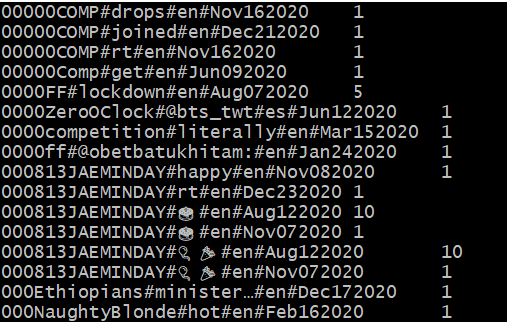
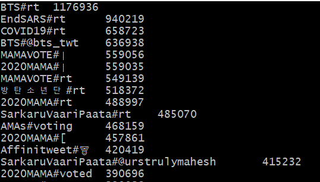
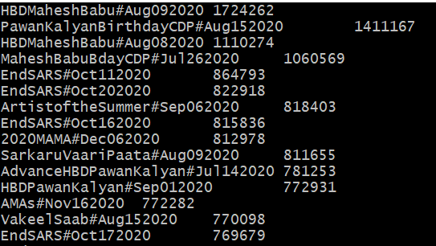

# Hashtag Analysis
Using [Map-Reduce](https://en.wikipedia.org/wiki/MapReduce) this Project is analysing Hashtags from Twitter. See [here](https://github.com/Deischox/Praktikum2021) for the Frontend and [here](https://jerryy33.github.io/UHH.Praktikum2021.MapReduce/apidocs/) for Javadocs

## Table of contents
* [General info](#general-info)
* [Screenshots](#screenshots)
* [Technologies](#technologies)
* [Setup](#setup)
* [Status](#status)
* [Inspiration](#inspiration)
* [Contact](#contact)

## General info
### English:
Since hashtags have been introduced they are a key factor for social media platforms such as Twitter. Hashtags are used as keywords, many users use hashtags to describe their tweet in one short description. This categorizes tweets and tweets can be found faster because of that.
User than can search for hashtags to find all tweets who are using the specified hashtag. Every person with a socialmedia profile can create a hashtag, over time a lot of hashtags have been created, some more popular than others. Many of them don't have a clear meaning at first look, the reason for this is that hashtags are mostly used as abbreviations (e.g. blm stands for BlackLivesMatter).

This project handles this problem and tries to visualize(see [Frontend](https://github.com/Deischox/Praktikum2021) for more info) the meaning and context of different hashtags. Based on tweets of the year 2020 we show all words which are mostly used with a specific hashtag. We also show in which time period during 2020 hashtags were used intensely and not so intensly. We only include tweets whose language is regarded (by Twitter) as English, Spanish or German. 

Visit [Demo](http://basecamp-demos.informatik.uni-hamburg.de:8080/hashtag-analyse-1/dashboard) to try it yourself.

### German:
Seit Ihrer Einführung sind Hashtags zu einem wichtigen Bestandteil, der weltweiten Social-Media-Plattform geworden und befinden sich heutzutage in fast allen Beiträgen
des Mikroblogging-Dienstes Twitter, genauso wie auch in anderen sozialen Netzwerken. Dort dienen sie nämlich als Schlagwörter. Wer zu einem bestimmten Thema etwas postet,
kann dafür sorgen, dass sein Beitrag schneller gefunden werden kann, indem er zusätzlich ein passendes Hashtag zu seinem Beitrag hinzufügt, welches diesen inhaltlich beschreibt.
Sucht man dann nach den Hashtags, für die man sich interessiert, findet man alle Beiträge, die zusammen mit diesem Schlagwort verfasst wurden.
Jede Person, die auf einem sozialen Netzwerk wie Twitter oder Instagram angemeldet ist, kann ein Hashtag erstellen und ihn so benennen, wie Sie es möchte.
So kann es passieren, dass mit der Zeit Hashtags entstehen, deren Bedeutung nicht wirklich eindeutig sind.

Genau mit dieser Problematik setzt sich dieses Projekt auseinander. Basierend auf Tweets aus dem Jahr
2020 liefern wir Ihnen alle Wörter, die in Verbindung mit den meist eingesetzten Hashtags aus diesem Zeitraum aufgetaucht sind.
Dadurch soll die Bedeutung von den Hashtags, anhand der Wörtern zu identifiziert werden, mit denen sie am öftesten erschienen sind.
Somit können Sie auf einen der Hashtags klicken und es werden Ihnen die Wörter aufgelistet, die in dem Zeitraum prozentual am häufigsten in Verbindung mit dem Hashtag aufgetaucht sind.
Auf unser Website kann dies auprobiert werden [Demo](http://basecamp-demos.informatik.uni-hamburg.de:8080/hashtag-analyse-1/dashboard).

## Screenshots
To get a overview what this part of the  project generates:

Output Job1:

Output Job2:

Output Job3:

## Technologies
* [Java 8](https://www.java.com/download/help/java8.html)
* [Maven 3.6.3](https://maven.apache.org/download.cgi)
* [Hadoop 3.2.1](https://hadoop.apache.org/docs/stable/hadoop-project-dist/hadoop-common/release/3.2.1/RELEASENOTES.3.2.1.html)
* [JSON Simple 1.1.1](https://code.google.com/archive/p/json-simple/)
* [JUnit 4.13.2](https://junit.org/junit4/)

## Setup
First you need to scrape data from Twitter, so you can execute map-reduce on this data, you can find more on this on the [Twitter Api](https://developer.twitter.com/en/docs/getting-started).
Using [Hadoop](http://hadoop.apache.org/) this Project can be executed to get the necessary data. Open the project in any IDE and build the project using [Maven](https://maven.apache.org/), make sure you have all the correct versions installed (see [Technologies](#technologies)). Executing the maven lifecycle should give you a jar file which you can use to execute map-reduce on your data via hadoop. For example you can use the command: hadoop jar yourJar path/to/your/data outputFolder. This is going to execute all 3 Jobs automatically for you, mak sure you don't loose connection to the server otherwise only the first Job will come through. [Screen](https://wiki.ubuntuusers.de/Screen/) is very useful for this.

## Status
Project is finished

## Inspiration
https://github.com/basecamp-uhh/Java-MapReduce

## Contact
jeremy.herbst@studium.uni-hamburg.de
